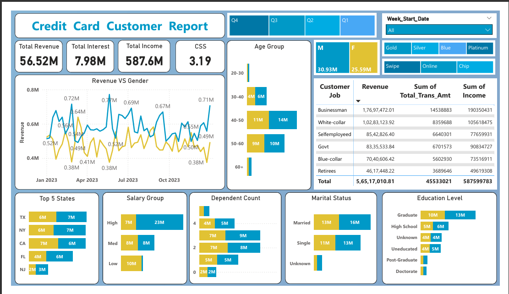

# Transaction Behavior Analysis using Power BI

  

## 📄 Overview
This project enables end-to-end analysis of credit card transactions, helping businesses and individuals understand spending patterns, customer behavior, and financial trends. Using **Power BI**, the application provides interactive dashboards and advanced visualization tools for insightful decision-making.

---

## 🧰 Technologies Used
- **Languages:** SQL, DAX  
- **Tools & Libraries:** Power BI, Pandas (for preprocessing, optional)  
- **Databases:** CSV / SQL databases  
- **Other:** Jupyter Notebook (for preprocessing and analysis if needed)

---

## 🗂️ Dataset
- **Source:** User-provided credit card transaction data (CSV or database)  
- **Description:** Dataset includes transaction details such as date, amount, merchant, category, and payment type.  
- **Goal:** Analyze transactions to identify spending patterns, detect anomalies, and gain actionable insights.

---

## 🚀 Key Features
1. **End-to-End Analysis:** Process, clean, and analyze credit card transaction data.  
2. **Customer Insights:** Understand customer behavior and spending trends.  
3. **Interactive Dashboards:** Filter transactions by date, merchant, category, or customer for detailed insights.  
4. **Visualization Tools:** Use bar charts, line graphs, pie charts, and KPI cards to interpret data.  
5. **Real-Time Updates:** Support for live transaction data to keep dashboards current.  
6. **SQL Integration:** Perform in-depth querying for advanced analytics.

---

## 📊 Dashboards
- **Monthly Spending Overview:** Analyze spending trends month-by-month.  
- **Category Analysis:** Breakdown of expenses by merchant or category.  
- **Customer Behavior:** Identify top spenders, recurring patterns, and anomalies.  
- **Transaction Summary:** Total amounts, counts, and average spending per period.  

---

## 🔧 Setup Instructions
1. Download or connect your transaction dataset (CSV/SQL).  
2. Open Power BI Desktop and import your dataset.  
3. Apply necessary transformations and create relationships if needed.  
4. Build dashboards using filters, visuals, and KPI cards.  
5. Publish reports to Power BI Service for sharing and real-time updates.

---

## 🔍 Key Insights
- Identify high-spending categories and peak transaction periods.  
- Detect unusual transactions or anomalies.  
- Understand customer segmentation based on transaction patterns.  
- Monitor trends over time for informed decision-making.

---
